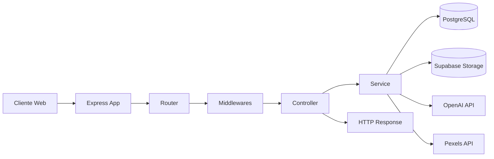
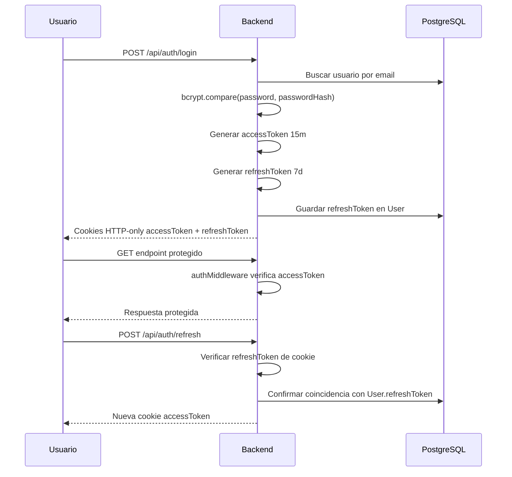
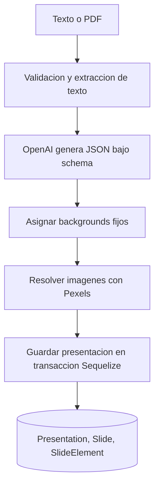

# Arquitectura del backend

## Vision general

El backend esta construido como una API REST monolitica modular sobre Express 5. La arquitectura es sencilla y efectiva para un MVP: rutas delgadas, controladores con logica de orquestacion, servicios con integraciones externas y modelos Sequelize para persistencia.

## Patron arquitectonico

Patron principal detectado:

- arquitectura en capas;
- estilo MVC ligero;
- servicios de dominio para integraciones con OpenAI, Pexels y Supabase;
- middleware como mecanismo transversal para autenticacion, uploads y ownership.

## Separacion de responsabilidades

| Capa | Responsabilidad | Archivos principales |
| --- | --- | --- |
| Entrada HTTP | Configuracion global, CORS, cookies, montaje de rutas | `src/app.js`, `src/index.js` |
| Routing | Definicion de endpoints y composicion de middlewares | `src/routes/*.routes.js` |
| Controllers | Validacion basica, manejo de respuestas, coordinacion | `src/controllers/*.controller.js` |
| Services | Logica de negocio e integraciones | `src/services/*.service.js` |
| Persistence | Modelos Sequelize y asociaciones | `src/models/*.model.js`, `src/models/relations.js` |
| Infraestructura | Conexion PostgreSQL y cliente Supabase | `src/db/*.js` |
| Cross-cutting | Auth, validacion de ownership, uploads | `src/middleware/*.js` |
| Utilidades | JWT y validadores de payload | `src/utils/*.js` |

## Componentes principales

### App bootstrap

- `src/app.js` crea la aplicacion Express.
- Se habilitan `express.json()`, `cookie-parser` y `cors`.
- `trust proxy` se fija en `1`, lo que indica despliegue esperado detras de proxy reverso.
- Las rutas se exponen bajo `/api/...`.

### Inicio del servidor

- `src/index.js` autentica Sequelize contra PostgreSQL.
- Importa `src/models/relations.js` para registrar asociaciones.
- Ejecuta mantenimiento inicial de imagenes de usuario.
- Inicia un `setInterval` para limpieza periodica.

### Persistencia

- PostgreSQL es accedido mediante Sequelize.
- No hay migraciones ni seeders detectados.
- El esquema observado proviene de definiciones de modelo en codigo.

### Integraciones externas

- OpenAI Responses API para generar JSON estructurado de presentaciones.
- Pexels API para resolver imagenes sugeridas por la IA.
- Supabase Storage para almacenar imagenes optimizadas del usuario.
- Resend para enviar correos de recuperacion de contrasena.

## Flujo general de requests

## Flujo de autenticacion

## Flujo de generacion de presentaciones

## Relacion entre capas

- Las rutas casi nunca llaman servicios directamente; siempre pasan por controladores.
- Los controladores de presentaciones e imagenes dependen de servicios especializados.
- Los controladores de usuarios y login hablan tanto con modelos como con utilidades.
- Los middlewares de ownership acceden a modelos directamente para cortar la peticion antes del controlador.

## Servicios principales

| Servicio | Funcion |
| --- | --- |
| `presentation.service.js` | Generacion, enriquecimiento y persistencia de presentaciones. |
| `openai.service.js` | Construccion del prompt y llamada a OpenAI con JSON schema estricto. |
| `pexels.service.js` | Resolucion de imagenes relacionadas con el contenido. |
| `userImage.service.js` | Optimizacion, hash, subida, limpieza y limitacion de imagenes de usuario. |

## Decisiones de diseno observadas

- Cookies seguras (`secure: true`) para tokens, apuntando a despliegues HTTPS.
- Uploads en memoria con `multer.memoryStorage()`, lo que simplifica integraciones pero aumenta presion de RAM.
- Modelo de ownership parcial: existe para `slide-elements` y `user-images`, pero no cubre todos los recursos.
- La generacion de presentaciones usa schema estricto para acotar la salida de la IA.

## Hallazgos arquitectonicos

### Fortalezas

- Separacion razonable entre HTTP, logica de negocio e infraestructura.
- Uso de transacciones al guardar presentaciones generadas.
- Mantenimiento automatico de imagenes de usuario.
- Integraciones externas concentradas en servicios.

### Limitaciones

- No hay capa formal de validacion de entrada global.
- El dominio esta acoplado a detalles de Express en varios controladores.
- Falta una estrategia de migraciones y versionado del esquema.
- No hay abstraccion de permisos/roles; la autorizacion es ad hoc por middleware.
- No hay observabilidad estructurada, solo `console.log`.

## Mejoras arquitectonicas recomendadas

1. Introducir validacion declarativa por esquema para request bodies y query params.
2. Crear middlewares de ownership para `presentations`, `slides` y `users`.
3. Externalizar configuracion sensible a un modulo de config tipado.
4. Agregar migraciones Sequelize o herramienta equivalente.
5. Incorporar logging estructurado, manejo centralizado de errores y tests.
