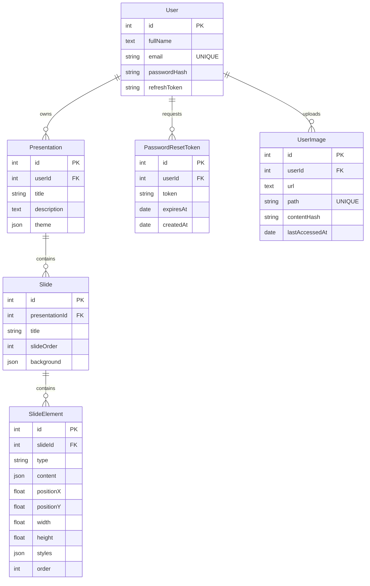

# Base de datos

## Vision general

El backend usa PostgreSQL mediante Sequelize. No se detectaron migraciones en el repositorio, por lo que la siguiente documentacion refleja el esquema inferido a partir de `src/models/*.model.js` y `src/models/relations.js`.

## Entidades detectadas

| Tabla / Modelo | Proposito funcional |
| --- | --- |
| `Users` / `User` | Cuentas de usuario, credenciales y refresh token vigente. |
| `PasswordResetTokens` / `PasswordResetToken` | Tokens temporales para recuperacion de contrasena. |
| `Presentations` / `Presentation` | Cabecera de la presentacion generada o editada por el usuario. |
| `Slides` / `Slide` | Diapositivas pertenecientes a una presentacion. |
| `SlideElements` / `SlideElement` | Elementos visuales editables de una diapositiva. |
| `user_images` / `UserImage` | Metadatos de imagenes de usuario almacenadas en Supabase Storage. |

## Modelos Sequelize

### User

| Campo | Tipo | Null | Restricciones |
| --- | --- | --- | --- |
| `id` | INTEGER | No | PK, autoincrement |
| `fullName` | TEXT | No | - |
| `email` | STRING | No | unique |
| `passwordHash` | STRING | No | hash bcrypt |
| `refreshToken` | STRING | Si | token persistido para refresh |
| `createdAt` | DATE | No | timestamp Sequelize |
| `updatedAt` | DATE | No | timestamp Sequelize |

### PasswordResetToken

| Campo | Tipo | Null | Restricciones |
| --- | --- | --- | --- |
| `id` | INTEGER | No | PK, autoincrement |
| `userId` | INTEGER | No | FK a `User.id` |
| `token` | STRING | No | token hexadecimal |
| `expiresAt` | DATE | No | expiracion logica |
| `createdAt` | DATE | No | default `NOW` |

Notas:

- `timestamps: false`
- no se define `updatedAt`

### Presentation

| Campo | Tipo | Null | Restricciones |
| --- | --- | --- | --- |
| `id` | INTEGER | No | PK, autoincrement |
| `userId` | INTEGER | No | FK a `User.id` |
| `title` | STRING | No | - |
| `description` | TEXT | Si | - |
| `theme` | JSONB | Si | configuracion visual |
| `createdAt` | DATE | No | timestamp Sequelize |
| `updatedAt` | DATE | No | timestamp Sequelize |

### Slide

| Campo | Tipo | Null | Restricciones |
| --- | --- | --- | --- |
| `id` | INTEGER | No | PK, autoincrement |
| `presentationId` | INTEGER | No | FK a `Presentation.id` |
| `title` | STRING | Si | - |
| `slideOrder` | INTEGER | No | orden logico dentro de la presentacion |
| `background` | JSONB | Si | fondo, color, gradiente o imagen |
| `createdAt` | DATE | No | timestamp Sequelize |
| `updatedAt` | DATE | No | timestamp Sequelize |

### SlideElement

| Campo | Tipo | Null | Restricciones |
| --- | --- | --- | --- |
| `id` | INTEGER | No | PK, autoincrement |
| `slideId` | INTEGER | No | FK a `Slide.id` |
| `type` | ENUM | No | `text`, `title`, `image`, `list` |
| `content` | JSONB | No | payload del elemento |
| `positionX` | FLOAT | No | default `0` |
| `positionY` | FLOAT | No | default `0` |
| `width` | FLOAT | No | default `100` |
| `height` | FLOAT | No | default `50` |
| `styles` | JSONB | Si | estilos visuales |
| `order` | INTEGER | No | default `0` |
| `createdAt` | DATE | No | timestamp Sequelize |
| `updatedAt` | DATE | No | timestamp Sequelize |

### UserImage

| Campo | Tipo | Null | Restricciones |
| --- | --- | --- | --- |
| `id` | INTEGER | No | PK, autoincrement |
| `userId` | INTEGER | No | FK a `User.id` |
| `url` | TEXT | No | URL publica en Supabase |
| `path` | STRING | No | unique |
| `contentHash` | STRING | Si | hash SHA-256 de la imagen optimizada |
| `lastAccessedAt` | DATE | No | default `NOW` |
| `createdAt` | DATE | No | timestamp Sequelize |
| `updatedAt` | DATE | No | timestamp Sequelize |

Indices detectados en `user_images`:

- indice por `userId`
- indice compuesto por `userId, lastAccessedAt`
- indice unico compuesto por `userId, contentHash`

## Relaciones

| Relacion | Tipo | FK |
| --- | --- | --- |
| `User` -> `Presentation` | 1:N | `Presentation.userId` |
| `User` -> `PasswordResetToken` | 1:N | `PasswordResetToken.userId` |
| `User` -> `UserImage` | 1:N | `UserImage.userId` |
| `Presentation` -> `Slide` | 1:N | `Slide.presentationId` |
| `Slide` -> `SlideElement` | 1:N | `SlideElement.slideId` |

## Cascadas

Configuradas en relaciones Sequelize:

- `User.hasMany(UserImage, { onDelete: 'CASCADE' })`
- `Presentation.hasMany(Slide, { onDelete: 'CASCADE' })`
- `Slide.hasMany(SlideElement, { onDelete: 'CASCADE' })`

Observacion:

- `PasswordResetToken` no declara `onDelete: 'CASCADE'` explicitamente.
- Sin migraciones no es posible asegurar que todas las FK y cascadas existan exactamente asi en una base ya desplegada.

## Diagrama ER

## Restricciones y notas funcionales

- `email` es unico a nivel de modelo.
- `SlideElement.type` restringe el tipo de elemento en BD.
- `path` es unico para evitar colisiones de archivos en Storage.
- `contentHash` permite deduplicacion por usuario, no global.
- `slideOrder` y `order` no tienen restriccion unica; el orden se conserva por logica de aplicacion.

## Riesgos y mejoras de base de datos

1. Falta un sistema de migraciones reproducible.
2. No se observan validaciones de longitud o formato a nivel de modelo.
3. `refreshToken` se almacena en texto plano en la tabla de usuarios.
4. `PasswordResetToken.token` no esta hasheado antes de persistirse.
5. No hay indices visibles para busquedas por `email`, `presentationId` o `slideId`, salvo los que PostgreSQL cree implicitamente por constraints y PK.
