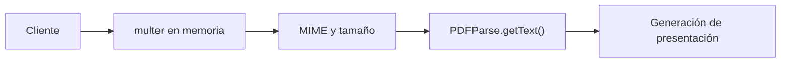

# Manejo de archivos

## Tipos de archivo detectados

| Tipo | Entrada | Destino |
| --- | --- | --- |
| PDF | `/api/presentations/pdf` | parseo en memoria, no persistencia local |
| Imagen de usuario | `/api/user-images/` | Supabase Storage + tabla `user_images` |

## Upload de PDF

### Middleware

- Archivo: `src/middleware/pdf.middleware.js`
- Implementacion: `multer.memoryStorage()`
- Campo esperado: `file`
- MIME permitido: `application/pdf`
- Tamano maximo: `10 MB`

### Flujo



### Comportamiento funcional

- el archivo no se guarda en disco;
- si no hay texto extraible, la peticion falla;
- el texto resultante se usa como entrada para OpenAI.

## Upload de imagenes de usuario

### Middleware

- Archivo: `src/middleware/userImage.middleware.js`
- Implementacion: `multer.memoryStorage()`
- Acepta: un solo archivo `image/*`
- Tamano maximo: `USER_IMAGE_MAX_UPLOAD_MB`

### Pipeline de procesamiento

1. `multer` recibe la imagen en memoria.
2. `sharp` corrige rotacion y hace resize manteniendo proporcion.
3. La imagen se convierte a WebP.
4. Se calcula hash SHA-256 sobre el binario optimizado.
5. Se verifica si el mismo usuario ya subio ese contenido.
6. Se sube a Supabase Storage.
7. Se persiste un registro `UserImage` con URL publica y metadata.
8. Se aplican politicas de limpieza por antiguedad y limite de cantidad.

### Almacenamiento

- Proveedor: Supabase Storage
- Bucket: `SUPABASE_IMAGE_BUCKET` o `user-images`
- Visibilidad: el servicio obtiene `publicUrl`, por lo que el acceso es publico via URL

### Estructura del path

```text
users/{userId}/{timestamp}-{random}.webp
```

## Limpieza y mantenimiento

### Limpieza por antiguedad

- se consideran expiradas las imagenes cuyo `lastAccessedAt` sea anterior a `USER_IMAGE_MAX_AGE_DAYS`;
- puede ejecutarse por usuario en cada request o globalmente al arrancar el servidor.

### Limpieza por limite

- si un usuario supera `USER_IMAGE_MAX_ITEMS`, se eliminan primero las menos accedidas.

### Tarea periodica

- `startUserImageMaintenance()` crea un `setInterval`;
- frecuencia definida por `USER_IMAGE_CLEANUP_INTERVAL_HOURS`.

## Templates y archivos auxiliares

Directorio `src/slides_templates/`:

- `Presentationtemplate.json`
- `ia.json`

Observacion:

- son artefactos de referencia o prueba;
- no se detecto uso activo en la ruta de ejecucion actual;
- en `presentation.controller.js` hay imports comentados asociados a estos templates.

## Riesgos y recomendaciones

| Riesgo | Impacto |
| --- | --- |
| Uploads en memoria | Mayor consumo de RAM bajo concurrencia |
| URLs publicas de imagenes | Requiere validar si el modelo de privacidad es intencional |
| Limpieza en proceso HTTP | Puede competir por recursos con peticiones del usuario |
| Sin antivirus ni scanning | Archivos maliciosos pueden pasar si son imagenes parseables |

Recomendaciones:

1. Considerar uploads por streaming para archivos grandes.
2. Mover mantenimientos a jobs o cron externos.
3. Evaluar signed URLs si las imagenes no deben ser publicas.
4. Agregar validacion de dimensiones y tipos reales mas estricta.
