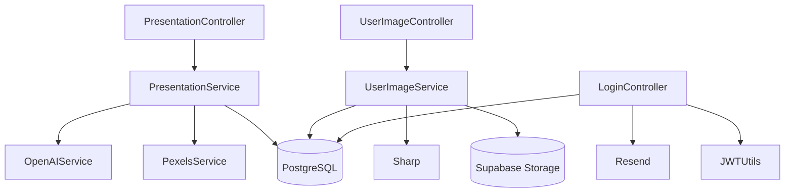

# Servicios y logica de negocio

## Vision general

La capa `src/services/` concentra la logica que trasciende el request HTTP. Actualmente el backend define cuatro servicios principales:

| Servicio | Responsabilidad |
| --- | --- |
| `presentation.service.js` | Generar, enriquecer y persistir presentaciones. |
| `openai.service.js` | Solicitar a OpenAI un JSON valido segun schema. |
| `pexels.service.js` | Resolver imagenes sugeridas por la IA. |
| `userImage.service.js` | Gestionar uploads, optimizacion y limpieza de imagenes. |

## `presentation.service.js`

### Responsabilidades

- guardar una presentacion completa dentro de una transaccion;
- reconstruir una presentacion con slides y elementos;
- listar presentaciones de un usuario con metricas basicas;
- invocar OpenAI para generar contenido;
- aplicar backgrounds fijos por tipo de slide;
- enriquecer elementos `image` usando Pexels.

### Funciones principales

| Funcion | Descripcion |
| --- | --- |
| `savePresentation(data, userId)` | Crea `Presentation`, `Slide` y `SlideElement` en una transaccion Sequelize. |
| `getPresentationById(presentationId)` | Lee y formatea una presentacion con include anidado. |
| `getPresentations(userId)` | Lista cabeceras del usuario y agrega `slidesCount` y `firstSlide`. |
| `generatePresentation({ text, title, numberOfSlides })` | Orquesta IA, fondo fijo, ultima slide de cierre e imagenes de Pexels. |

### Dependencias

- `sequelize` para transacciones
- modelos `Presentation`, `Slide`, `SlideElement`
- `generatePresentationWithAI`
- `searchPexelsImage`

### Reglas funcionales observadas

- toda presentacion generada debe tener `slides` en formato de arreglo;
- se agrega manualmente una diapositiva final llamada `Cierre Presentacion`;
- los fondos de portada, contenido y cierre son URLs fijas embebidas en codigo;
- las imagenes resueltas se insertan como `content.resolvedImage`.

### Riesgos o limitaciones

- las URLs de fondo estan hardcodeadas;
- el enriquecimiento con Pexels es secuencial, no paralelo;
- si no hay presentaciones, `getPresentations` lanza error 404 en vez de devolver lista vacia.

## `openai.service.js`

### Responsabilidades

- construir prompt del sistema y prompt del usuario;
- llamar a OpenAI Responses API;
- forzar salida JSON bajo schema estricto;
- parsear la respuesta.

### Entrada

- `text`
- `title` opcional
- `numberOfSlides` opcional

### Salida

- objeto JSON parseado con forma de presentacion.

### Dependencias

- `openai`
- `src/schemas/presentation.schema.js`
- variables `OPENAI_API_KEY`, `OPENAI_MODEL`

### Decision de diseno relevante

Se usa `text.format.type = 'json_schema'` con `strict: true`, lo que reduce respuestas libres y mejora la interoperabilidad con el frontend.

### Riesgos o limitaciones

- no hay reintentos, timeout personalizado ni manejo granular de errores;
- el prompt indica maximo 4 elementos por slide, pero la validacion posterior de `slide-elements` no acepta exactamente la misma estructura para imagenes;
- no hay cache de resultados.

## `pexels.service.js`

### Responsabilidades

- recibir una intencion de busqueda de imagen;
- convertir orientaciones del dominio a los valores esperados por Pexels;
- hacer `fetch` a la API externa;
- devolver metadatos resumidos de la mejor imagen.

### Contrato

Entrada esperada:

```json
{
  "query": "artificial intelligence education",
  "style": "photo",
  "orientation": "horizontal"
}
```

Salida resumida:

```json
{
  "url": "https://images.pexels.com/...",
  "alt": "Image alt text",
  "photographer": "Name",
  "photographerUrl": "https://www.pexels.com/@author",
  "pexelsUrl": "https://www.pexels.com/photo/..."
}
```

### Riesgos o limitaciones

- depende de `fetch` global del runtime;
- no hay fallback si Pexels falla, salvo `resolvedImage: null`;
- no hay control de cuota ni backoff.

## `userImage.service.js`

### Responsabilidades

- optimizar imagenes con `sharp`;
- generar hash SHA-256 para deduplicacion por usuario;
- subir WebP a Supabase Storage;
- crear y borrar registros `UserImage`;
- eliminar imagenes expiradas o excedentes;
- mantener `lastAccessedAt`.

### Funciones principales

| Funcion | Descripcion |
| --- | --- |
| `optimizeImageBuffer(buffer)` | Corrige rotacion, resizea y convierte a WebP. |
| `uploadUserImage({ userId, fileBuffer })` | Sube la imagen y crea su metadato persistente. |
| `cleanupExpiredUserImages({ userId })` | Elimina imagenes con `lastAccessedAt` vencido. |
| `enforceUserImageLimit(userId)` | Mantiene el maximo permitido por usuario. |
| `touchUserImageAccess(userImage)` | Actualiza fecha de ultimo acceso. |
| `startUserImageMaintenance()` | Programa limpieza periodica en background. |

### Configuracion usada

- `SUPABASE_IMAGE_BUCKET`
- `USER_IMAGE_MAX_ITEMS`
- `USER_IMAGE_MAX_AGE_DAYS`
- `USER_IMAGE_MAX_DIMENSION`
- `USER_IMAGE_QUALITY`
- `USER_IMAGE_MAX_UPLOAD_MB`
- `USER_IMAGE_CLEANUP_INTERVAL_HOURS`

### Reglas funcionales observadas

- las imagenes se almacenan como `.webp`;
- el path sigue la forma `users/{userId}/{timestamp}-{random}.webp`;
- si una imagen optimizada ya existe para el usuario, se rechaza con `409`;
- al fallar la persistencia despues del upload, el archivo se elimina del bucket.

### Riesgos o limitaciones

- `multer.memoryStorage` y `sharp` trabajan en memoria;
- la limpieza periodica corre dentro del mismo proceso HTTP;
- no hay cola de trabajos ni aislamiento del procesamiento pesado.

## Dependencias entre modulos



## Servicios externos detectados

| Servicio externo | Uso |
| --- | --- |
| OpenAI | Generacion estructurada de presentaciones |
| Pexels | Resolucion de imagenes sugeridas |
| Supabase Storage | Almacenamiento de imagenes del usuario |
| Resend | Envio de correos de recuperacion |

## Mejoras recomendadas

1. Separar procesamiento pesado de IA e imagenes a jobs asincronos.
2. Centralizar manejo de errores externos con reintentos y trazabilidad.
3. Introducir interfaces o wrappers de proveedor para facilitar testing.
4. Extraer backgrounds fijos a configuracion.
